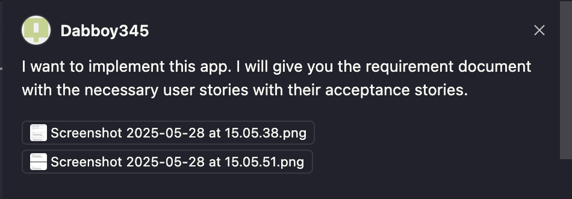
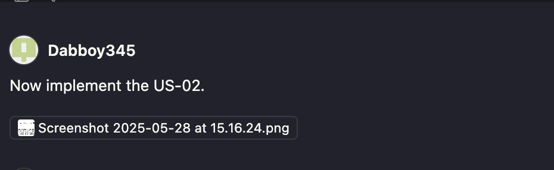
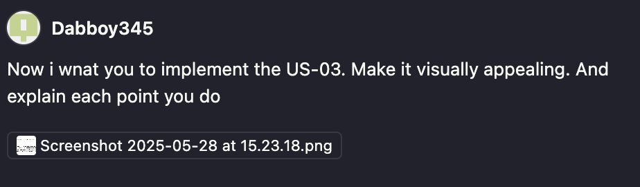
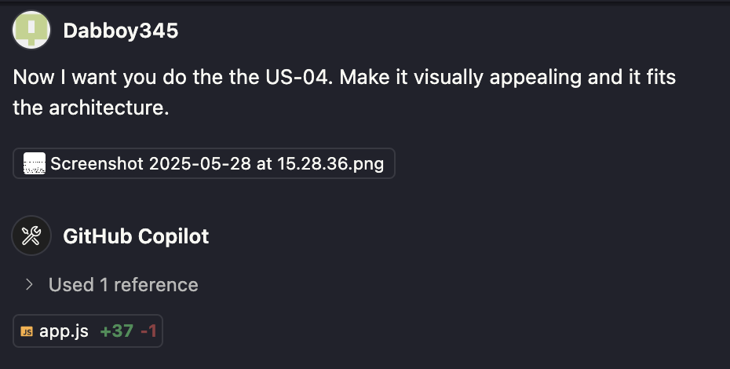
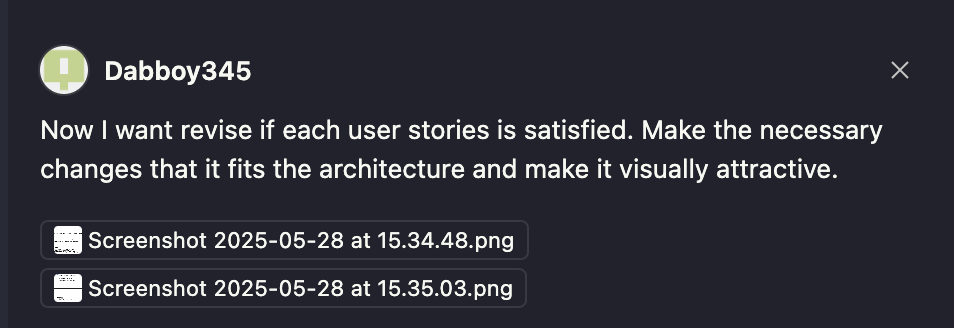
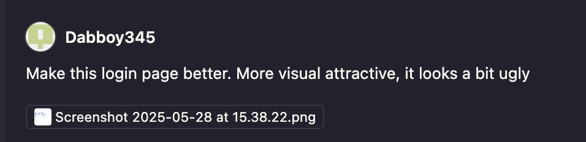
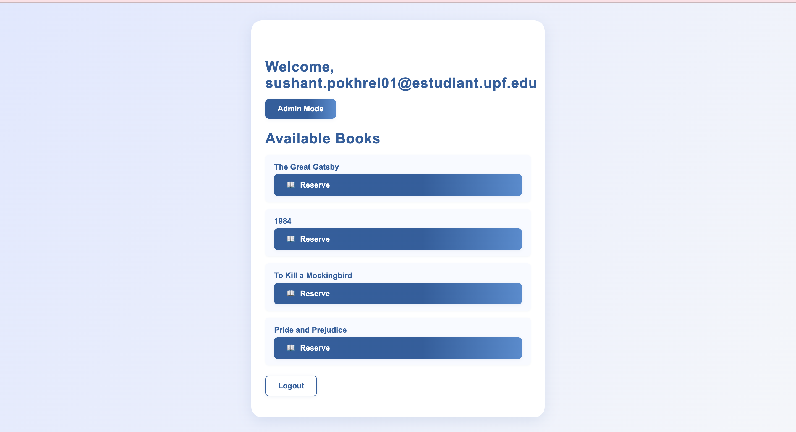
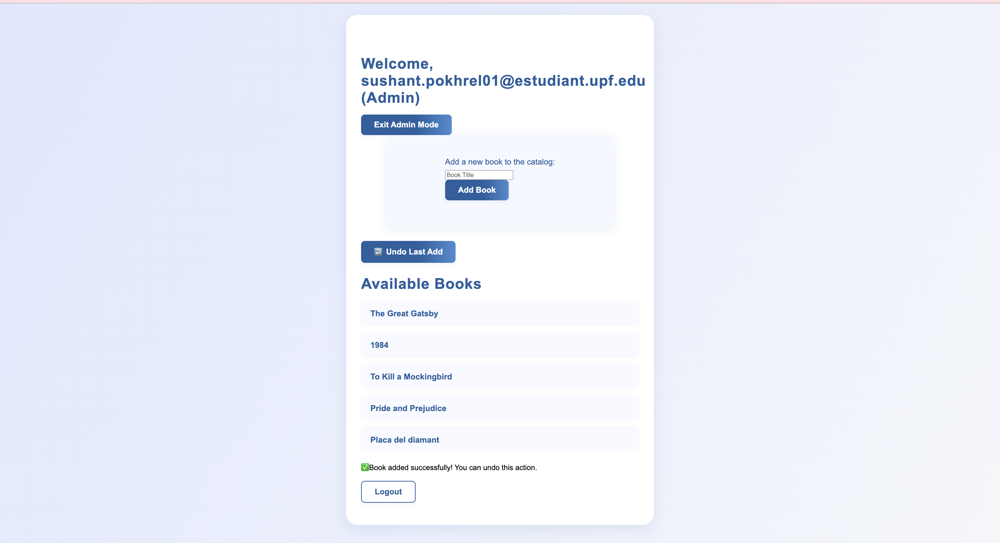
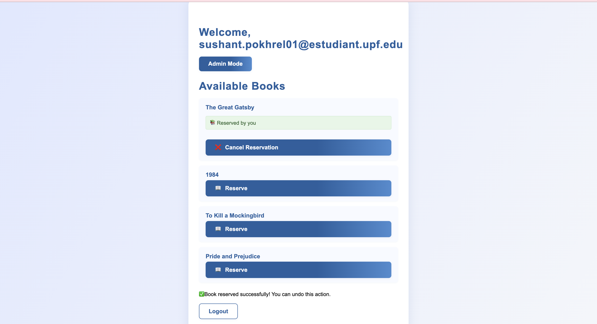

# LIBARY RESERVATIONS

## GROUP 12
- Alex Roig
- Claudia Hereter
- Jana Baguer
- Oscar Salueña
- Paula Navarro
- Sushant Pokhrel

## GITHUB
https://github.com/Dabboy345/LAB-6-G12.git

## PROMTS USED 

- 1st Prompt:

- 2nd Prompt:

- 3rd Prompt:

- 4th Prompt:

- 5th Prompt:

- 6th Prompt:

- 7th Prompt:

- 8th Prompt:

- 9th Prompt:

## SCREENSHOT OF THE RESULT OF THE APPLICATION 
- REGISTRATION

- RESERVE AVALIABLE BOOK

- ADMINISTRATOR

- CANCEL RESERVATION

## LESSONS LEARNT

- Copilot is very useful and it helps you to augment your productivity. If you give clear instructions then it noramlly does the majority of the work correctly but there are still details that should be improved. We also noticed that if you give feedback to the copilot and tell what it should do, then it improves its performance. 
- You also have to take into account which model you are using, we should know that each model has its own benefits. 
- For the visual aspects of the app you are developing you need to write many prompts because it dosen't always do the right work. You have to iterate this many process times. For example in our case we repeated it multiple times to make the website visually appealing. 
- The better the prompt is the better the output, so we have to aviod being vague. 